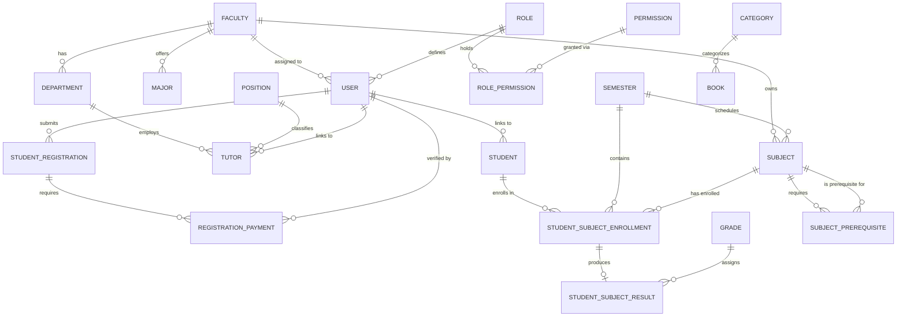
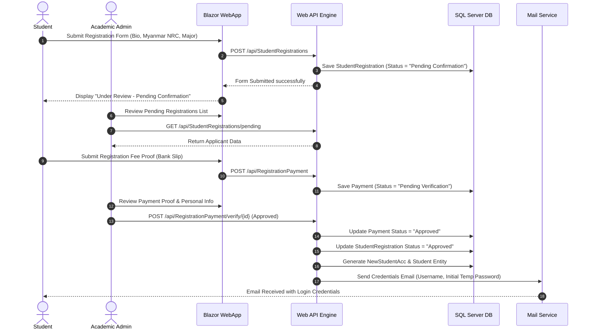
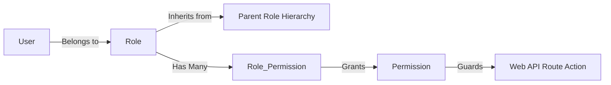

# Smart Campus System Design Specification (PUMUB)

## 1. Executive Summary & Overview

The **Smart Campus System (PUMUB)** is an end-to-end higher education management and campus digital services platform built for modern university administration, academic management, and student services. 

The platform connects Students, Faculty (Tutors & Professors), Academic Registrars, Financial Officers, and System Administrators into a unified digital ecosystem. It streamlines the student lifecycle from initial application and Myanmar NRC credential verification, to admin approval, fee payment verification, subject enrollment, grade processing, and campus facility interaction (Library & Campus Announcements).

---

## 2. High-Level System Architecture

The Smart Campus System follows a modern multi-tier decoupled architecture comprising a **Blazor Web Application** front-end, an **ASP.NET Core Web API** microservice-ready application layer, and a **SQL Server** relational database managed via **Entity Framework Core**.

```mermaid
graph TD
    subgraph Client Layer (Blazor SPA / Interactive Web)
        A1[Student Portal]
        A2[Admin & Registrar Dashboard]
        A3[Faculty & Tutor Interface]
    end

    subgraph Application & API Layer (ASP.NET Core 8 Web API)
        B1[Authentication & AuthZ Filter]
        B2[Student & Admission Controller]
        B3[Academic & Subject Engine]
        B4[Payment & Fees Controller]
        B5[Library & Services Controller]
        B6[Mail & Notification Service]
    end

    subgraph Data & Storage Layer (EF Core 8 / SQL Server)
        C1[(SmartCampusDbContext)]
        C2[File / Receipt Storage]
    end

    A1 -->|HTTP REST / JSON| B1
    A2 -->|HTTP REST / JSON| B1
    A3 -->|HTTP REST / JSON| B1

    B1 --> B2
    B1 --> B3
    B1 --> B4
    B1 --> B5

    B2 --> C1
    B3 --> C1
    B4 --> C1
    B4 --> C2
    B5 --> C1
    B6 -->|SMTP / Mail Server| A1
```

### Technology Stack Summary

| Layer | Technology / Framework | Details |
| :--- | :--- | :--- |
| **Frontend Framework** | Blazor Web App (.NET 8) | Interactive Razor Components, MudBlazor / Custom CSS |
| **Backend API** | ASP.NET Core 8 Web API | RESTful controllers, Swagger OpenAPI, Custom Filters |
| **ORM / Data Access** | Entity Framework Core 8 | Code-First / DbFirst hybrid, LINQ queries, Migrations |
| **Database Engine** | Microsoft SQL Server 2022 | Relational schema with foreign keys, constraints & triggers |
| **Authentication** | JWT / Session-based Auth | Custom Permission & Role Hierarchy validation |
| **Email Service** | SMTP / MailKit | Automated credential dispatch & status notifications |

---

## 3. Core Database Schema & Entity-Relationship Design

### 3.1 Entity Relationship Diagram (ERD)



---

### 3.2 Data Dictionary Summary

#### 1. Identity & Governance Domain
- **`User`**: System user credentials (`UserId`, `Username`, `Email`, `PasswordHash`, `RoleId`, `FacultyId`, `Status`, `IsDelete`).
- **`Role`**: Access roles (`RoleId`, `RoleName`, `Description`).
- **`Permission`**: Fine-grained feature permissions (`PermissionId`, `PermissionName`, `Code`).
- **`RolePermission`**: Junction mapping for dynamic RBAC (`RoleId`, `PermissionId`).
- **`RoleHierarchy`**: Inheritance hierarchy (`ParentRoleId`, `ChildRoleId`).
- **`Position`**: Staff/Tutor academic positions (`PositionId`, `PositionTitle`).

#### 2. Student Admission & Registration Domain
- **`RegisterAccount`**: Student sign-up queue (`RegisterAccId`, `ApplicantName`, `Email`, `Phone`, `Status`).
- **`NewStudentAcc`**: Generated student portal credentials (`NewStudentAccId`, `Username`, `Password`, `MustChangePassword`, `AccountStatus`).
- **`StudentPersonalInfo`**: Complete applicant bio data (`InfoId`, `StudentNameEn`, `StudentNameMy`, `NrcNumber` *(Myanmar Script Required)*, `Dob`, `FatherName`, `Address`, `EmergencyContact`).
- **`StudentRegistration`**: Admission application record (`RegistrationId`, `UserId`, `ApplicationDate`, `Status` *["Pending Confirmation", "Approved", "Rejected"]*, `StipendRequested`).
- **`RegistrationPayment`**: Payment submission proof (`PaymentId`, `RegistrationId`, `Amount`, `SlipImagePath`, `PaymentDate`, `Status` *["Pending", "Approved", "Rejected"]*, `VerifyBy`).

#### 3. Academic & Enrolment Domain
- **`Faculty`**: University faculties (`FacultyId`, `FacultyName`).
- **`Department`**: Academic departments (`DepartmentId`, `DepartmentName`, `FacultyId`).
- **`Major`**: Degree majors (`MajorId`, `MajorName`, `FacultyId`).
- **`Semester`**: Academic terms (`SemesterId`, `SemesterName`, `StartDate`, `EndDate`).
- **`Subject`**: Course offerings (`SubjectId`, `SubjectCode`, `SubjectName`, `CreditHours`, `FacultyId`, `SemesterId`).
- **`SubjectPrerequisite`**: Prerequisite rules (`SubjectId`, `PrerequisiteSubjectId`).
- **`Tutor`**: Instructor records (`TutorId`, `UserId`, `DepartmentId`, `PositionId`, `Qualification`).
- **`Student`**: Enrolled active student (`StudentId`, `UserId`, `RollNo`, `MajorId`, `Status`).
- **`StudentSubjectEnrollment`**: Course registration (`EnrollmentId`, `StudentId`, `SubjectId`, `SemesterId`, `EnrollmentDate`).
- **`StudentSubjectResult`**: Academic performance (`ResultId`, `EnrollmentId`, `Marks`, `GradeId`, `Remarks`).
- **`Grade`**: Grading scale mapping (`GradeId`, `GradeLetter`, `MinMark`, `MaxMark`, `GpaPoint`).

#### 4. Campus Services & Auxiliary Domain
- **`PaymentFee`**: Fee structure catalog (`FeesId`, `FeeName`, `Amount`, `Description`, `Status`).
- **`Activity`**: Campus events and announcements (`ActivityId`, `Title`, `Description`, `EventDate`, `ImageUrl`).
- **`Category`**: Library catalog categories (`CategoryId`, `CategoryName`).
- **`Book`**: Library books inventory (`BookId`, `Title`, `Author`, `Isbn`, `CategoryId`, `QuantityAvailable`).
- **`RulesRegulation`**: Published institutional policies (`RuleId`, `Title`, `Content`, `Category`).

---

## 4. Key Workflows & Business Logic Specifications

### 4.1 Student Admission & Account Activation Lifecycle



#### Key Rules:
1. **Myanmar NRC Validation Constraint**: The NRC input field enforces strict regex requiring Myanmar Unicode characters (`[က-ဟ]`).
2. **Pending State Lockdown**: While `Status == "Pending Confirmation"`, student access remains locked; student cannot enroll in courses until Admin verifies application and payment.
3. **Password Security**: Upon first login with generated credentials, `MustChangePassword == true` forces mandatory password reset.

---

### 4.2 Granular Dynamic RBAC Security Model



- Dynamic permission evaluations occur on API endpoints using a custom HTTP Action Filter (`[HasPermission("PERMISSION_CODE")]`).
- Hierarchical inheritance allows `SuperAdmin` to inherit all `Registrar` and `Tutor` capabilities seamlessly.

---

### 4.3 Subject Enrollment Engine & Prerequisites Enforcement

When a student requests enrollment in a course (`SubjectId`):
1. **Prerequisite Check**: System queries `SubjectPrerequisite` for target `SubjectId`. If prerequisites exist, system checks `StudentSubjectResult` to ensure prerequisite courses are completed with a passing grade.
2. **Self-Prerequisite Prevention**: Database check constraint `CK_No_Self_Prereq` prevents circular subject dependency (`SubjectId <> PrerequisiteSubjectId`).
3. **Duplicate Registration Guard**: Unique constraint `UQ_Student_Subject_Semester` prevents double-enrollment in the same course within the same term.

---

## 5. Web API Interface Blueprint

| Controller | HTTP Method | Endpoint Route | Description |
| :--- | :--- | :--- | :--- |
| **`AuthController`** | `POST` | `/api/Auth/login` | Authenticates user & issues JWT token |
| **`AuthController`** | `POST` | `/api/Auth/change-password` | Initial forced password change endpoint |
| **`StudentRegistrationsController`**| `POST` | `/api/StudentRegistrations` | Submit new student registration |
| **`StudentRegistrationsController`**| `GET` | `/api/StudentRegistrations/pending` | Fetch pending registrations for Admin review |
| **`RegistrationPaymentController`** | `POST` | `/api/RegistrationPayment` | Upload fee payment receipt |
| **`RegistrationPaymentController`** | `PUT` | `/api/RegistrationPayment/{id}/verify`| Admin approve/reject payment & trigger onboarding |
| **`EnrollmentController`** | `POST` | `/api/Enrollment/enroll` | Enroll student in subject (Prerequisite validated) |
| **`StudentController`** | `GET` | `/api/Student/profile/{id}` | Retrieve comprehensive student profile |
| **`SubjectController`** | `GET` | `/api/Subject/faculty/{id}` | List all subject offerings by faculty |
| **`MailController`** | `POST` | `/api/Mail/send-credentials` | Trigger automated credential dispatch email |

---

## 6. UI / UX Component Architecture (Blazor)

The frontend is structured cleanly into feature modules:
- **`Components/Features/Student`**:
  - `StudentRegister.razor` / `.cs`: Multi-step admission application form.
  - `Page_StudentPersonalInfo.razor`: Myanmar NRC bio form.
  - `RegistrationPayment.razor`: Payment slip upload & fee calculator.
  - `StudentEnrollment.razor`: Interactive course selector with prerequisite validation notices.
  - `StudentProfile.razor`: Student transcript & dashboard view.
- **`Components/Features/Admin`**:
  - `Dashboard.razor`: Real-time enrollment & revenue statistics.
  - `RegisterAcc/`: Admission applicant verification queue.
  - `Role_Permission/`: Matrix editor for dynamic role permissions.
  - `Student/`, `Tutor/`, `Subject/`, `PaymentFee/`: Management CRUD modules.

---

## 7. Security, Auditing & Maintainability Standards

1. **Soft-Delete Integrity**: Data entities feature `IsDelete` boolean flags instead of physical SQL deletions, ensuring audit preservation.
2. **Audit Timestamps**: Entity creation dates (`CreatedDateTime`) default automatically via SQL `GETDATE()`.
3. **Data Protection**: Sensitive password hashes use secure PBKDF2 / BCrypt hashing algorithms.
4. **Input Sanitization**: Web API requests sanitize all inputs to protect against XSS and SQL injection.

---
*Document Version: 1.0.0*  
*Project Name: Smart Campus PUMUB System*  
*Author: System Architecture Team*
